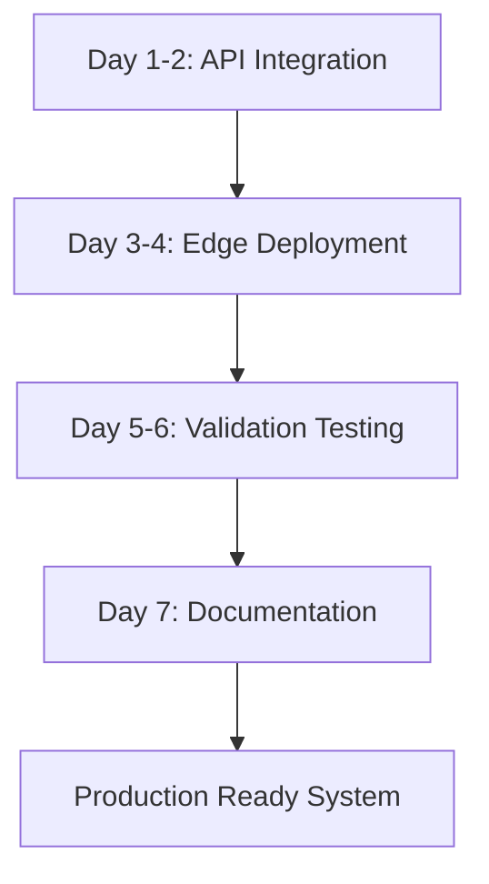

# 🔗 TUẦN 6 - INTEGRATION & TESTING PLAN

## 📋 **OVERVIEW**

**Mục tiêu:** Tích hợp các AI models đã được optimize vào microservices architecture và thực hiện comprehensive testing trên edge devices.

**Thời gian:** 5-7 ngày intensive integration
**Input:** Optimized AI models từ TUẦN 5
**Output:** Production-ready integrated system

---

## 🎯 **INTEGRATION OBJECTIVES**

### **1. 🔗 API Integration**
- Integrate optimized AI models vào Model Server
- Connect Model Server với API Gateway
- Setup authentication & authorization
- Implement rate limiting & caching
- Create REST API endpoints cho tất cả models

### **2. 🧪 Performance Testing**
- Deploy system lên edge devices (Pi 5, Rock 5, Jetson)
- Test optimized models trên actual hardware
- Measure real-world performance vs simulated results
- Validate power consumption và thermal management
- Cross-platform compatibility testing

### **3. ✅ Accuracy Validation**
- Test AI models với real-world data
- Validate accuracy sau optimization
- Compare performance vs baseline
- Edge case handling validation
- Quality assurance testing

### **4. 📚 Documentation**
- API documentation (OpenAPI/Swagger)
- Model usage guides
- Deployment instructions
- Troubleshooting guides
- Performance optimization guides

---

## 🏗️ **INTEGRATION ARCHITECTURE**

### **Microservices Integration Stack:**
```
┌─────────────────┐    ┌─────────────────┐    ┌─────────────────┐
│   API Gateway   │────│  Model Server   │────│ Data Manager    │
│   (Port 8080)   │    │   (Port 8090)   │    │  (Port 8100)    │
└─────────────────┘    └─────────────────┘    └─────────────────┘
         │                       │                       │
         └───────────────────────┼───────────────────────┘
                                 │
                    ┌─────────────────┐
                    │   PostgreSQL    │
                    │   (Port 5432)   │
                    └─────────────────┘
```

### **AI Model Integration Flow:**
```
Input Data → API Gateway → Model Server → Optimized AI Models → Results → Data Manager → Database
```

---

## 📊 **WEEK 6 IMPLEMENTATION PLAN**

### **DAY 1-2: API Integration (Model Server)**
```python
# 1.1 Model Server Integration
- Create ModelServer service với FastAPI
- Load optimized models từ TUẦN 5
- Implement model inference endpoints
- Add model health checks
- Setup model versioning

# 1.2 API Gateway Integration
- Connect API Gateway với Model Server
- Implement authentication middleware
- Setup rate limiting
- Add request/response logging
- Create unified API documentation
```

### **DAY 3-4: Edge Device Deployment**
```bash
# 3.1 Raspberry Pi 5 + Hailo-8
- Deploy optimized models
- Test Hailo-8 acceleration
- Measure actual performance
- Validate power consumption

# 3.2 Radxa Rock 5 ITX
- Deploy RKNN optimized models
- Test NPU acceleration
- Performance benchmarking
- Thermal management testing

# 3.3 Jetson Nano
- Deploy TensorRT optimized models
- Test CUDA acceleration
- Memory optimization validation
- Performance comparison
```

### **DAY 5-6: Accuracy & Performance Validation**
```python
# 5.1 Real-World Testing
- Test với real camera feeds
- Validate accuracy với ground truth
- Performance stress testing
- Error handling validation

# 5.2 Cross-Platform Testing
- Compare performance across devices
- Validate consistency
- Test failover mechanisms
- Load balancing testing
```

### **DAY 7: Documentation & Production Ready**
```markdown
# 7.1 Complete Documentation
- API documentation
- Deployment guides
- Performance optimization guides
- Troubleshooting documentation

# 7.2 Production Readiness
- Final integration testing
- Performance validation
- Security testing
- Production deployment preparation
```

---

## 🛠️ **INTEGRATION COMPONENTS**

### **1. 🔧 Model Server Integration**
```python
# services/model_server/main.py
- FastAPI application
- Model loading và management
- Inference endpoints
- Health checks
- Performance monitoring
```

### **2. 🌐 API Gateway Enhancement**
```python
# services/api_gateway/main.py
- Model service routing
- Authentication middleware
- Rate limiting
- Request logging
- Error handling
```

### **3. 📊 Data Manager Integration**
```python
# services/data_manager/main.py
- Results storage
- Database operations
- File management
- Analytics data
```

### **4. 🔍 Integration Testing Suite**
```python
# tests/integration/
- End-to-end testing
- Performance testing
- Accuracy validation
- Edge device testing
```

---

## 📈 **TESTING FRAMEWORK**

### **1. 🧪 Integration Tests**
```python
# Test Categories:
- API Integration Tests
- Model Inference Tests
- Cross-Service Communication Tests
- Database Integration Tests
- Authentication & Authorization Tests
```

### **2. 🚀 Performance Tests**
```python
# Performance Metrics:
- Inference latency (<100ms target)
- Throughput (30+ FPS target)
- Memory usage (<2GB target)
- CPU utilization (<80% target)
- GPU/NPU utilization monitoring
```

### **3. ✅ Accuracy Tests**
```python
# Accuracy Validation:
- Model accuracy vs baseline (>95% target)
- Cross-platform consistency
- Real-world data validation
- Edge case handling
- Error rate monitoring
```

### **4. 🔧 Edge Device Tests**
```python
# Device-Specific Tests:
- Hardware acceleration validation
- Power consumption measurement
- Thermal management testing
- Platform-specific optimization verification
```

---

## 🎯 **EXPECTED OUTCOMES**

### **Integration Targets:**
| Component | Target | Measurement |
|-----------|--------|-------------|
| **API Latency** | <50ms | End-to-end response time |
| **Model Inference** | <100ms | Per model processing time |
| **Throughput** | 30+ FPS | Concurrent request handling |
| **Accuracy** | >95% | Model accuracy retention |
| **Uptime** | 99.9% | Service availability |

### **Platform Performance Targets:**
| Platform | FPS Target | Memory Target | Power Target |
|----------|------------|---------------|--------------|
| **Pi 5 + Hailo** | 35+ FPS | <500MB | <8W |
| **Rock 5 ITX** | 30+ FPS | <1GB | <10W |
| **Jetson Nano** | 25+ FPS | <2GB | <10W |
| **myai (Dev)** | 40+ FPS | <1GB | N/A |

---

## 🔧 **IMPLEMENTATION TOOLS**

### **1. 🚀 Integration Tools**
```python
# tools/integration_tester.py
- End-to-end testing automation
- Performance benchmarking
- Accuracy validation
- Cross-platform testing
```

### **2. 📊 Deployment Tools**
```python
# tools/edge_deployer.py
- Automated edge device deployment
- Model distribution
- Configuration management
- Health monitoring
```

### **3. 📈 Monitoring Tools**
```python
# tools/integration_monitor.py
- Real-time performance monitoring
- Service health checking
- Error tracking
- Performance analytics
```

---

## 🚨 **INTEGRATION CHALLENGES & SOLUTIONS**

### **Technical Challenges:**
- **Model Loading Time** → Lazy loading + caching
- **Memory Constraints** → Model sharing + optimization
- **Network Latency** → Local edge processing
- **Hardware Compatibility** → Platform-specific builds

### **Integration Challenges:**
- **Service Communication** → Message queues + retry logic
- **Data Consistency** → Transaction management
- **Error Handling** → Circuit breakers + fallbacks
- **Performance Monitoring** → Comprehensive metrics

---

## 📋 **SUCCESS CRITERIA**

### **✅ Integration Complete When:**
- [ ] All AI models integrated into Model Server
- [ ] API Gateway routing working
- [ ] Edge device deployment successful
- [ ] Performance targets achieved
- [ ] Accuracy validation passed
- [ ] Documentation completed

### **🎯 Ready for TUẦN 7 When:**
- [ ] Integrated system working on all platforms
- [ ] Performance benchmarks documented
- [ ] Real-world testing completed
- [ ] Production deployment ready
- [ ] Monitoring systems operational

---

## 🚀 **DELIVERABLES**

### **Code Deliverables:**
- **Enhanced Model Server** với optimized models
- **Updated API Gateway** với model routing
- **Integration Test Suite** comprehensive testing
- **Edge Deployment Scripts** automated deployment

### **Documentation Deliverables:**
- **API Documentation** (OpenAPI/Swagger)
- **Deployment Guide** step-by-step instructions
- **Performance Report** benchmarking results
- **Troubleshooting Guide** common issues & solutions

### **Testing Deliverables:**
- **Integration Test Results** comprehensive validation
- **Performance Benchmarks** cross-platform comparison
- **Accuracy Validation Report** real-world testing results
- **Edge Device Compatibility** hardware validation

---

## 🎯 **WEEK 6 WORKFLOW**



**Status:** Ready to begin TUẦN 6 Integration & Testing! 🔗🧪
