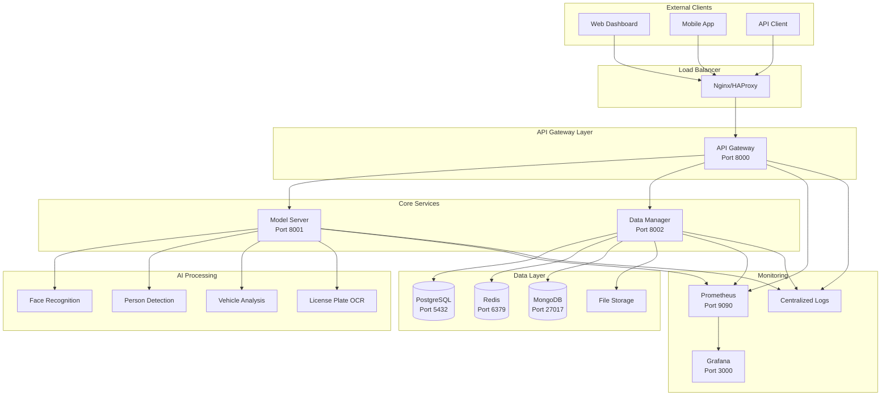

# 🏗️ AI BOX - MICROSERVICES ARCHITECTURE

## 📊 **SYSTEM OVERVIEW**



## 🎯 **SERVICE RESPONSIBILITIES**

### 🌐 **API Gateway (Port 8000)**

#### **Primary Functions:**
- **Request Routing:** Route requests to appropriate services
- **Authentication & Authorization:** JWT token validation
- **Rate Limiting:** Prevent API abuse
- **Request/Response Transformation:** Data format conversion
- **Load Balancing:** Distribute load across service instances
- **API Documentation:** Swagger/OpenAPI integration
- **CORS Handling:** Cross-origin request management
- **Logging & Monitoring:** Request/response logging

#### **Technology Stack:**
- **Framework:** FastAPI + Uvicorn
- **Authentication:** JWT with Redis session store
- **Rate Limiting:** Redis-based sliding window
- **Load Balancing:** Round-robin with health checks
- **Monitoring:** Prometheus metrics

#### **Endpoints:**
```
/auth/*           → Authentication service
/devices/*        → Device management
/models/*         → AI model management
/human-analysis/* → Route to Model Server
/vehicle-analysis/* → Route to Model Server
/analytics/*      → Route to Data Manager
/system/*         → System management
```

### 🧠 **Model Server (Port 8001)**

#### **Primary Functions:**
- **AI Model Loading:** Dynamic model loading/unloading
- **Inference Processing:** Real-time AI inference
- **Model Optimization:** Platform-specific optimization
- **Batch Processing:** Efficient batch inference
- **Model Versioning:** A/B testing support
- **Performance Monitoring:** Inference metrics
- **Resource Management:** GPU/NPU utilization

#### **Technology Stack:**
- **Framework:** FastAPI + AsyncIO
- **AI Frameworks:** PyTorch, ONNX Runtime, TensorRT
- **Platform Support:**
  - **Raspberry Pi 5:** Hailo-8 SDK
  - **Radxa Rock 5:** RKNN Toolkit
  - **Jetson Nano:** TensorRT, CUDA
  - **Core i5:** CUDA, OpenVINO
- **Model Format:** PyTorch (.pt), ONNX (.onnx), TensorRT (.engine)

#### **AI Models:**
```
Human Analysis:
├── Face Detection (YOLOv8-Face)
├── Face Recognition (FaceNet, ArcFace)
├── Person Detection (YOLOv8-Person)
├── Pose Estimation (MediaPipe)
└── Behavior Analysis (Custom CNN)

Vehicle Analysis:
├── Vehicle Detection (YOLOv8-Vehicle)
├── License Plate Detection (YOLOv8-LPR)
├── OCR Engine (PaddleOCR, EasyOCR)
├── Vehicle Classification (ResNet50)
└── Traffic Analytics (Custom algorithms)
```

### 💾 **Data Manager (Port 8002)**

#### **Primary Functions:**
- **Database Operations:** CRUD operations for all data
- **Data Processing:** ETL pipelines for analytics
- **File Management:** Image/video storage and retrieval
- **Backup & Recovery:** Automated backup system
- **Data Analytics:** Real-time analytics processing
- **Report Generation:** Automated report creation
- **Data Validation:** Input validation and sanitization

#### **Technology Stack:**
- **Framework:** FastAPI + SQLAlchemy
- **Databases:**
  - **PostgreSQL:** Primary relational database
  - **Redis:** Caching and session storage
  - **MongoDB:** Document storage for metadata
- **File Storage:** Local filesystem + cloud storage (optional)
- **Analytics:** Pandas, NumPy for data processing

#### **Data Flow:**
```
Inference Results → Validation → Database Storage → Analytics Processing → Reports
```

## 🔄 **INTER-SERVICE COMMUNICATION**

### **Communication Patterns:**

#### **1. Synchronous Communication (HTTP/REST)**
```
API Gateway → Model Server (Inference requests)
API Gateway → Data Manager (Data queries)
Model Server → Data Manager (Store results)
```

#### **2. Asynchronous Communication (Message Queue)**
```
Model Server → Message Queue → Data Manager (Batch processing)
Data Manager → Message Queue → Analytics Service (Real-time analytics)
```

#### **3. Event-Driven Architecture**
```
Events:
- ModelInferenceCompleted
- DeviceStatusChanged
- DataBackupCompleted
- SystemAlertTriggered
```

### **Service Discovery:**
- **Development:** Static configuration
- **Production:** Consul/etcd service registry
- **Kubernetes:** Built-in service discovery

## 📊 **DATA FLOW ARCHITECTURE**

### **Real-time Inference Flow:**
```
1. Client uploads image → API Gateway
2. API Gateway validates request → Model Server
3. Model Server processes image → AI inference
4. Results sent to Data Manager → Store in database
5. Response returned to client via API Gateway
```

### **Batch Processing Flow:**
```
1. Scheduled job triggers → Data Manager
2. Data Manager queries unprocessed data → Database
3. Batch sent to Model Server → Batch inference
4. Results processed → Analytics pipeline
5. Reports generated → Notification system
```

### **Analytics Flow:**
```
1. Raw data collected → PostgreSQL
2. ETL pipeline processes data → Analytics database
3. Real-time dashboards → Grafana
4. Scheduled reports → Email/notifications
```

## 🔒 **SECURITY ARCHITECTURE**

### **Authentication & Authorization:**
```
JWT Token Flow:
1. User login → API Gateway
2. Credentials validated → User database
3. JWT token generated → Redis session store
4. Token returned to client
5. Subsequent requests include JWT → Token validation
```

### **Security Layers:**
- **Network Security:** VPN, firewall rules
- **API Security:** JWT authentication, rate limiting
- **Data Security:** Encryption at rest and in transit
- **Service Security:** mTLS between services
- **Input Validation:** Request sanitization and validation

### **Role-Based Access Control (RBAC):**
```
Roles:
├── Admin: Full system access
├── Operator: Device management, model deployment
├── Analyst: Read-only access to analytics
└── Viewer: Basic dashboard access
```

## 📈 **SCALABILITY DESIGN**

### **Horizontal Scaling:**
- **API Gateway:** Multiple instances behind load balancer
- **Model Server:** Auto-scaling based on CPU/GPU usage
- **Data Manager:** Read replicas for query scaling

### **Vertical Scaling:**
- **GPU Scaling:** Dynamic GPU allocation
- **Memory Scaling:** Adaptive memory management
- **Storage Scaling:** Auto-expanding storage volumes

### **Performance Optimization:**
```
Caching Strategy:
├── Redis: Session data, frequent queries
├── CDN: Static assets, model files
├── Application Cache: In-memory model cache
└── Database Cache: Query result caching
```

## 🔧 **DEPLOYMENT ARCHITECTURE**

### **Container Strategy:**
```
Services:
├── api-gateway:latest (Multi-arch: AMD64, ARM64)
├── model-server:raspberry-pi-5 (ARM64 + Hailo optimized)
├── model-server:radxa-rock-5 (ARM64 + NPU optimized)
├── model-server:jetson-nano (ARM64 + CUDA optimized)
├── model-server:core-i5 (AMD64 + CUDA optimized)
└── data-manager:latest (Multi-arch: AMD64, ARM64)
```

### **Platform-Specific Deployments:**

#### **Raspberry Pi 5 + Hailo-8:**
```yaml
services:
  api-gateway:
    image: ghcr.io/oryzasystems/ai-box-api-gateway:latest
    platform: linux/arm64
  
  model-server:
    image: ghcr.io/oryzasystems/ai-box-model-server:raspberry-pi-5
    platform: linux/arm64
    devices:
      - /dev/hailo0:/dev/hailo0
    environment:
      - DEVICE=hailo
      - HAILO_ARCH=hailo8
```

#### **Radxa Rock 5 ITX:**
```yaml
services:
  model-server:
    image: ghcr.io/oryzasystems/ai-box-model-server:radxa-rock-5
    platform: linux/arm64
    devices:
      - /dev/rknpu:/dev/rknpu
    environment:
      - DEVICE=npu
      - NPU_ARCH=rk3588
```

#### **Jetson Nano:**
```yaml
services:
  model-server:
    image: ghcr.io/oryzasystems/ai-box-model-server:jetson-nano
    platform: linux/arm64
    runtime: nvidia
    environment:
      - DEVICE=cuda
      - JETSON_MODEL=nano
```

## 📊 **MONITORING & OBSERVABILITY**

### **Metrics Collection:**
```
Application Metrics:
├── Request rate, latency, errors (API Gateway)
├── Inference time, throughput, accuracy (Model Server)
├── Database query time, connection pool (Data Manager)
└── Resource usage: CPU, memory, GPU (All services)
```

### **Logging Strategy:**
```
Log Levels:
├── DEBUG: Development debugging
├── INFO: General information
├── WARNING: Potential issues
├── ERROR: Error conditions
└── CRITICAL: System failures
```

### **Health Checks:**
```
Health Endpoints:
├── /health (Basic health check)
├── /health/ready (Readiness probe)
├── /health/live (Liveness probe)
└── /metrics (Prometheus metrics)
```

## 🚀 **PERFORMANCE TARGETS**

### **Latency Requirements:**
- **API Response Time:** < 100ms (95th percentile)
- **Face Recognition:** < 200ms per face
- **Person Detection:** < 150ms per image
- **License Plate OCR:** < 300ms per plate
- **Vehicle Classification:** < 100ms per vehicle

### **Throughput Requirements:**
- **API Gateway:** 1000+ requests/second
- **Model Server:** 50+ inferences/second per device
- **Data Manager:** 500+ database operations/second

### **Resource Utilization:**
- **CPU Usage:** < 80% average
- **Memory Usage:** < 85% of available
- **GPU Usage:** < 90% during inference
- **Disk I/O:** < 70% of capacity

## 🔄 **DISASTER RECOVERY**

### **Backup Strategy:**
- **Database:** Daily full backup + continuous WAL archiving
- **Model Files:** Versioned storage with checksums
- **Configuration:** Git-based configuration management
- **Logs:** Centralized log aggregation with retention

### **High Availability:**
- **Service Redundancy:** Multiple instances per service
- **Database Replication:** Master-slave PostgreSQL setup
- **Load Balancing:** Health check-based routing
- **Failover:** Automatic failover for critical services

### **Recovery Procedures:**
- **RTO (Recovery Time Objective):** < 15 minutes
- **RPO (Recovery Point Objective):** < 5 minutes data loss
- **Automated Recovery:** Self-healing containers
- **Manual Recovery:** Documented procedures for complex failures
